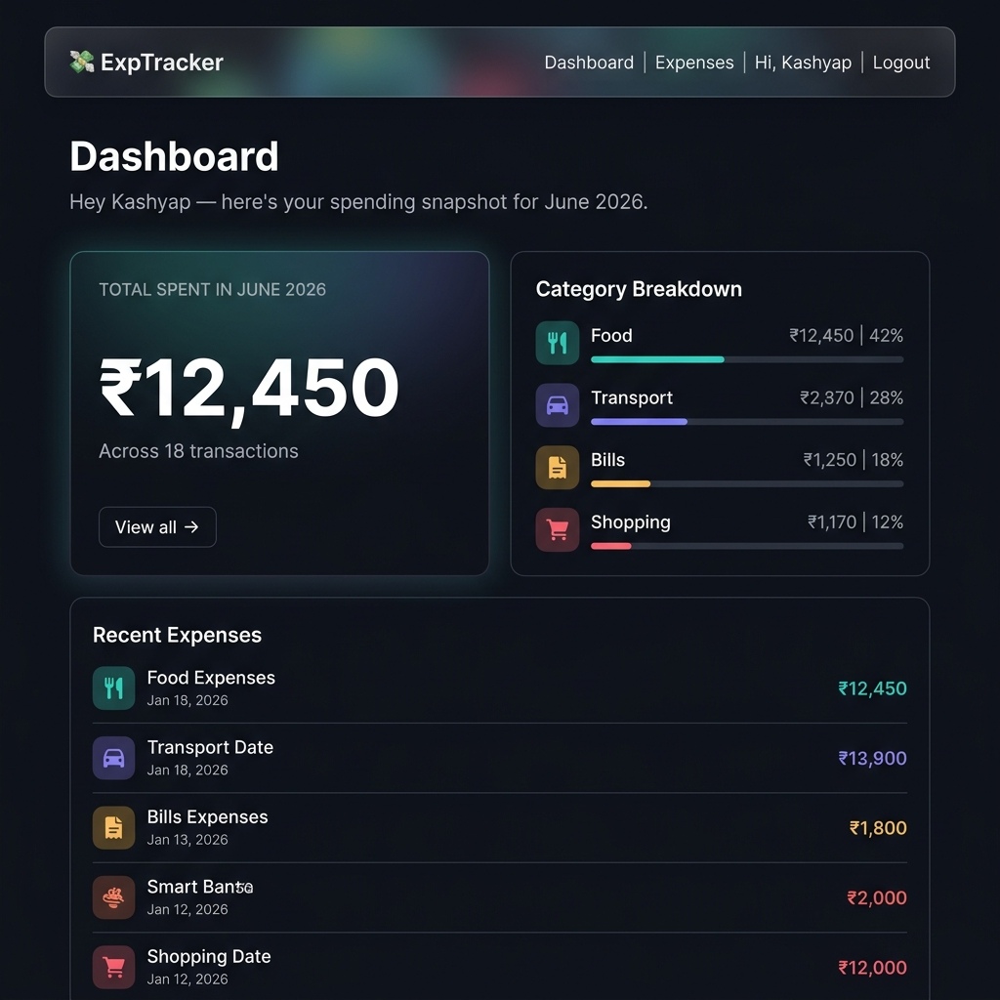
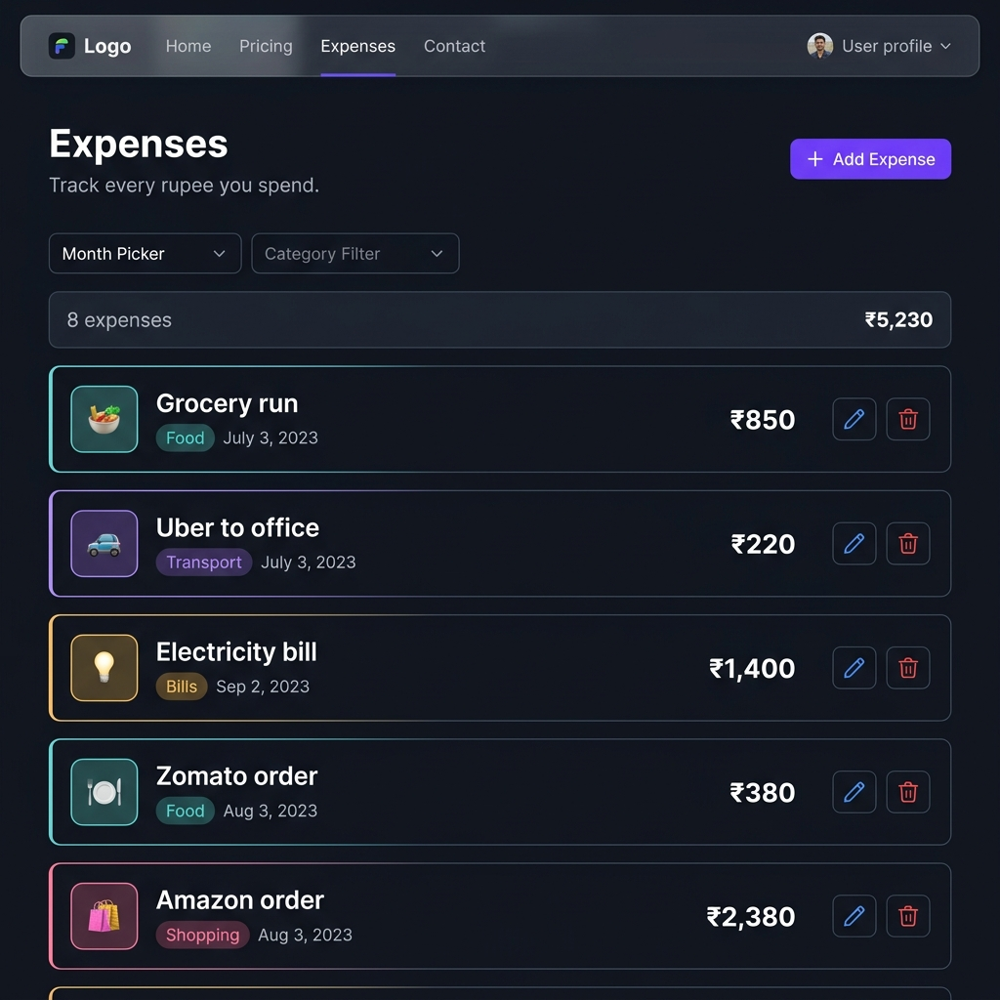

# ExpTracker 💸

A premium, dark-themed personal expense tracker built with React, Express, and MongoDB. Track your daily spending, organize by category, and get a clear monthly breakdown on a beautifully designed dashboard.



## Features

- **Secure Authentication**: Register and log in securely with JWT-based sessions.
- **Expense Management**: Add, edit, and delete expenses (title, amount, category, date).
- **Categorization**: Group spending into categories (Food, Transport, Bills, Shopping, Other) with distinct color coding.
- **Smart Dashboard**: Instantly see your total monthly spend and a visual percentage breakdown across categories, plus a quick view of your most recent expenses.
- **Filtering**: Easily filter your expenses list by month or specific category.
- **Premium UI**: Built with a custom dark-mode design system, featuring glassmorphism, smooth animations, and toast notifications.



## Project Structure

```
ExpTracker/
├── client/         React frontend (Vite)
└── server/         Express backend + MongoDB
```

## Tech Stack

| Layer | Technology |
|------|-----------|
| **Frontend** | React 18, Vite, React Router v6 |
| **Styling** | Custom Vanilla CSS (Design Tokens, CSS Variables) |
| **HTTP Client** | Axios (with interceptors) |
| **Notifications** | react-hot-toast |
| **Backend** | Node.js, Express.js |
| **Database** | MongoDB, Mongoose |
| **Authentication**| bcryptjs, jsonwebtoken |

## License

MIT
